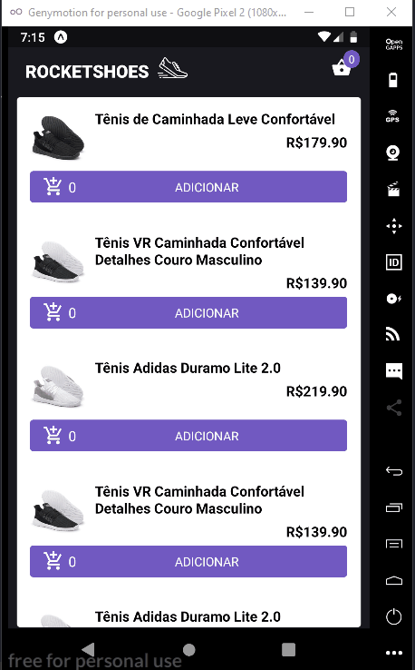

<h1 align="center">
    
</h1>

<h3 align="center">
  Arquitetura Flux
</h3>

<p align="center">
  

  <a href="https://https://www.linkedin.com/in/mesquini/">
    
  </a>

  
</p>

This project is based in the e-commerce created at the web
[rocketshoes](https://github.com/mesquini/rocketshoes). The project has the same functionalities as the web project but with a mobile interface.

<p align="center">
  <a href="#rocket-technologies">Technologies</a>&nbsp;&nbsp;&nbsp;|&nbsp;&nbsp;&nbsp;
  <a href="#information_source-how-to-use">How To Use</a>&nbsp;&nbsp;&nbsp;|&nbsp;&nbsp;&nbsp;
  <a href="#memo-license">License</a>
</p>

<p  align="center">
  
</p>


## :rocket: Technologies

This project was developed at the [RocketSeat GoStack Bootcamp](https://rocketseat.com.br/bootcamp) with the following technologies:

- [ReactJS](https://reactjs.org/)
- [Redux](https://redux.js.org/)
- [Redux-Saga](https://redux-saga.js.org/)
- [React Native](https://reactnative.dev/)
- [Axios](https://github.com/axios/axios)
- [History](https://www.npmjs.com/package/history)
- [Immer](https://github.com/immerjs/immer)
- [Polished](https://polished.js.org/)
- [reactotron-react-native](https://github.com/infinitered/reactotron)
- [styled-components](https://www.styled-components.com/)
- [React-Icons](https://react-icons.netlify.com/)
- [json-server](https://github.com/typicode/json-server)
- [Reactotron](https://infinite.red/reactotron)
- [VS Code][vc] with [EditorConfig][vceditconfig] and [ESLint][vceslint]

## :information_source: How To Use

To clone and run this application, you'll need [Git](https://git-scm.com), [Node.js v10.16][nodejs] or higher + [Yarn v1.13][yarn] or higher installed on your computer. From your command line:

```bash
# Clone this repository
$ git clone https://github.com/mesquini/rocketshoes-mobile

# Go into the repository
$ cd rocketshoes-mobile

# Install dependencies
$ yarn install

# Run the app
$ yarn start
```

## :memo: License

This project is under the MIT license. See the [LICENSE](https://github.com/mesquini/rocketshoes/blob/master/LICENSE) for more information.

---

Made with ♥ by Victor Mesquini :wave: [Get in touch!](https://www.linkedin.com/in/mesquini/)

[nodejs]: https://nodejs.org/
[yarn]: https://yarnpkg.com/
[vc]: https://code.visualstudio.com/
[vceditconfig]: https://marketplace.visualstudio.com/items?itemName=EditorConfig.EditorConfig
[vceslint]: https://marketplace.visualstudio.com/items?itemName=dbaeumer.vscode-eslint
